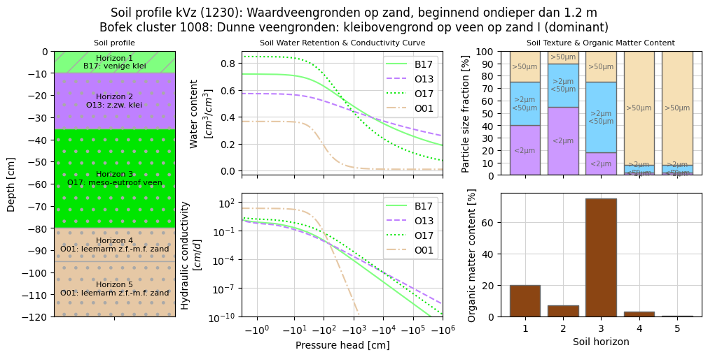

Getting started
===============

Installation
------------

To use DutchSoils, first install it using pip:

.. code-block:: console

   (.venv) $ pip install dutchsoils

Quick example
-------------

A quick example of getting a soil profile using geographical coordinates and plotting its properties is:

.. code-block:: python

   import dutchsoils as ds

   # Use a location to get a soil profile
   sp = ds.SoilProfile.from_location(x=171827, y=445436, crs="EPSG:28992")

   # Plot its properties
   sp.plot()

which results in:

Other examples that should help you on your way are given in the :doc:`examples <examples/index>` section.
